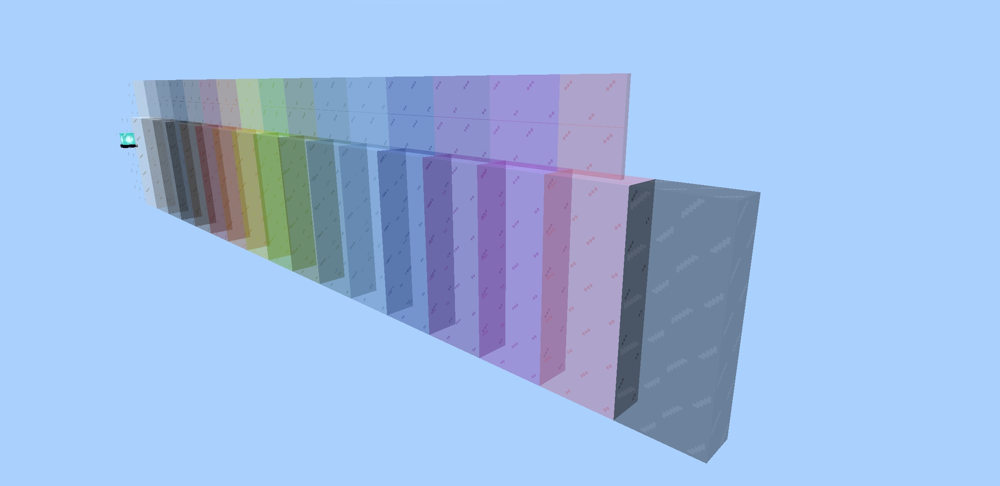
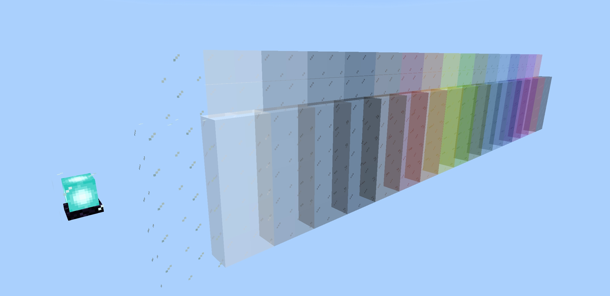
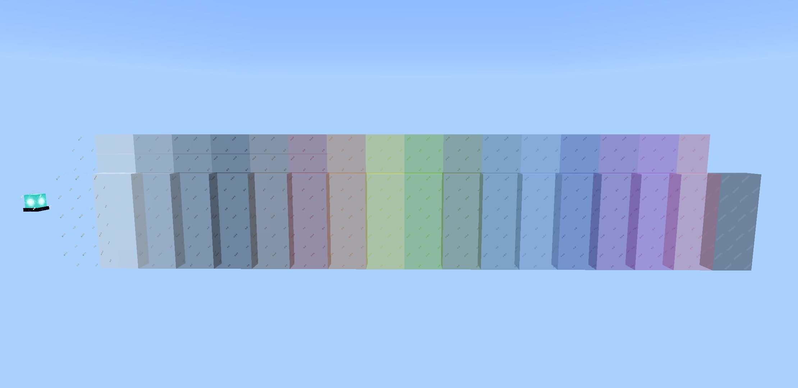

# Borderless Glass

A Minecraft Bedrock Edition resource pack that removes borders from glass.






## Building

Building this add-on requires the following tools:

- [Python 3.12 or greater & pip](https://www.python.org/)
- [Allay #de779a2](https://github.com/allay-mc/allay/commit/de779a278a76cdf7ee9d5a0906e2bedb2a2899dc)

```console
. .venv/bin/activate
pip install -r requirements.txt
allay build --release
```

